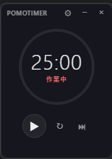

# PomoTimer

ミニマルな半透明ポモドーロタイマー デスクトップアプリ。

   

## 特徴

- **設定可能なタイマー** — 作業・休憩の時間を自由に設定
- **マウス追従ドット** — 円形プログレスリングの内側にマウス位置を示すドットを表示（アプリ外でも追従）
- **背景透明度** — 設定画面から透明度を調整可能
- **通知音** — デフォルトのベル音付き。任意のフォルダからカスタム音声ファイルを選択可能
- **ミニマルUI** — 半透明・常に最前面表示で作業の邪魔にならない
- **オフライン動作** — ネットワーク不要、完全ローカルで動作
- **システムトレイ** — 最小化時はトレイに格納

## スクリーンショット



## 技術スタック

- [Tauri v2](https://v2.tauri.app/) — Rustベースのデスクトップフレームワーク
- [React 19](https://react.dev/) + [TypeScript](https://www.typescriptlang.org/) — フロントエンド
- [Vite](https://vite.dev/) — ビルドツール / [Vitest](https://vitest.dev/) — テストフレームワーク

## 開発

### 前提条件

- [Node.js](https://nodejs.org/) (v18+)
- [Rust](https://www.rust-lang.org/tools/install) (latest stable)

### セットアップ

```bash
npm install
npm run tauri dev
```

### テスト

```bash
npm test              # 単発実行
npm run test:watch    # ウォッチモード
npm run test:coverage # カバレッジレポート
```

### ビルド

```bash
npm run tauri build
```

インストーラーが `src-tauri/target/release/bundle/nsis/` に生成されます。

## 更新履歴

| バージョン | 内容 |
|---|---|
| v0.2.2 | トレイアイコン二重表示バグ修正 / ユニットテスト追加 |
| v0.2.1 | 終了時にプロセスが残るバグ修正 |
| v0.2.0 | マウス追従ドット / 背景透明度設定 / 一時停止バグ修正 |
| v0.1.0 | 初回リリース |

## ライセンス

MIT
